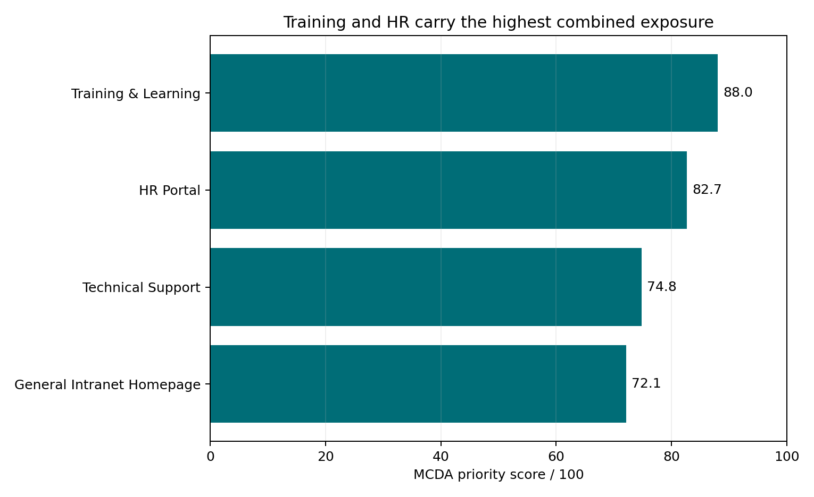
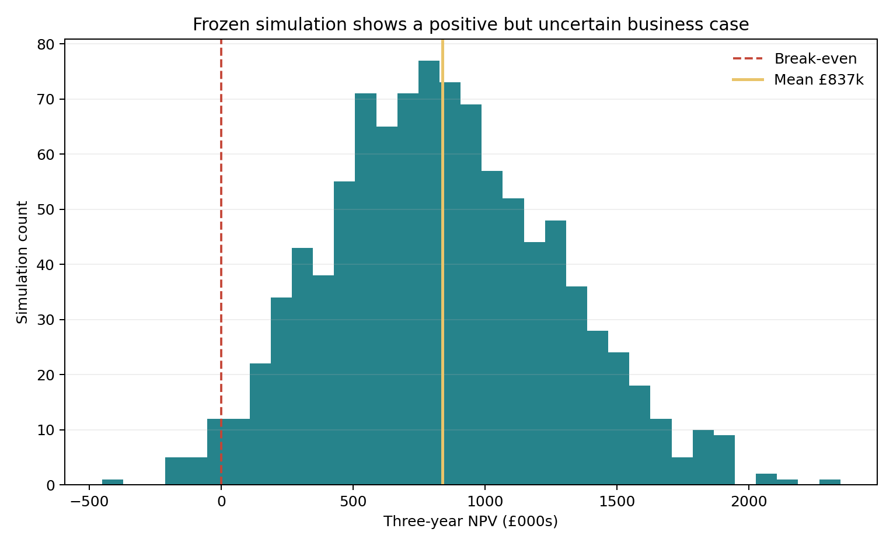

# Accessible Employee Services Business Case

**A prioritisation, cost-benefit and delivery model for making high-use employee self-service journeys accessible.**

> Portfolio context: this repository develops an MSc group case study into an auditable analyst portfolio. “GlobalTech” is the case organisation. The outputs are decision-support estimates, not a production accessibility certification or legal advice.

## Decision required

Approve a controlled 90-day stabilisation phase that fixes shared design-system barriers, establishes a WCAG 2.2 AA release gate and validates the highest-risk employee journeys before scaling an eight-month programme.

## Evidence at a glance

| Signal | Result | Implication |
| --- | ---: | --- |
| Employee and contractor population | 400,000 | Self-service failure can create enterprise-scale support demand |
| Annual views across four pages | 561,005 | The analysed journeys are materially used |
| Estimated accessibility issues | 137 | Manual verification and prioritised remediation are required |
| First redesign priority | Training & Learning, 88.0/100 | Highest combined traffic, issues and process exposure |
| Base implementation cost | £306,273 | Controlled programme investment |
| Base three-year NPV | £787,496 | Positive but assumption-dependent business case |
| Frozen simulation positive-NPV rate | 98% | Reported model remains positive across most sampled cases |





## Recommendation

1. Fix shared patterns before individual pages: colour tokens, focus, landmarks, headings, forms and error handling.
2. Prioritise Training & Learning and HR Portal for deeper redesign.
3. Require automated, keyboard, screen-reader and disabled-employee task testing before release.
4. Track employee task success, accessibility-related support demand, regression failures and exception ageing.
5. Validate model assumptions during discovery before committing the full budget.

## Working prototype

[Launch the interactive prototype](https://vedant-au.github.io/accessible-employee-services-business-case/) or serve [`prototype/index.html`](prototype/index.html) locally. It demonstrates skip navigation, semantic landmarks, labelled inputs, visible focus and text-based status. Automated validation is useful evidence, not certification; manual assistive-technology and user testing remain required.

## Analytical assets

- Sanitised reference tables and a frozen 1,000-run simulation audit trail
- Python reproduction of MCDA and base cost-benefit calculations
- Source-to-output reconciliation tests for transparent review
- Accessible HTML prototype
- Automated unit and reconciliation tests

## Reproduce

```bash
python -m venv .venv
source .venv/bin/activate
pip install -r requirements.txt
python analysis.py
python -m unittest discover -s tests -v
```

See [methodology](docs/METHODOLOGY.md), [validation status](docs/VALIDATION.md), [asset notice](ASSET_NOTICE.md), and [GitHub setup](GITHUB_SETUP.md).
